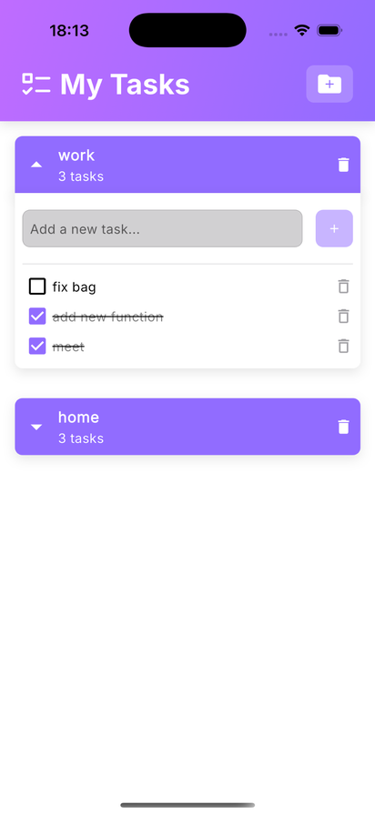
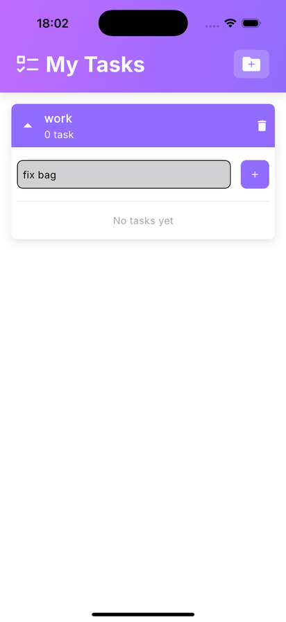
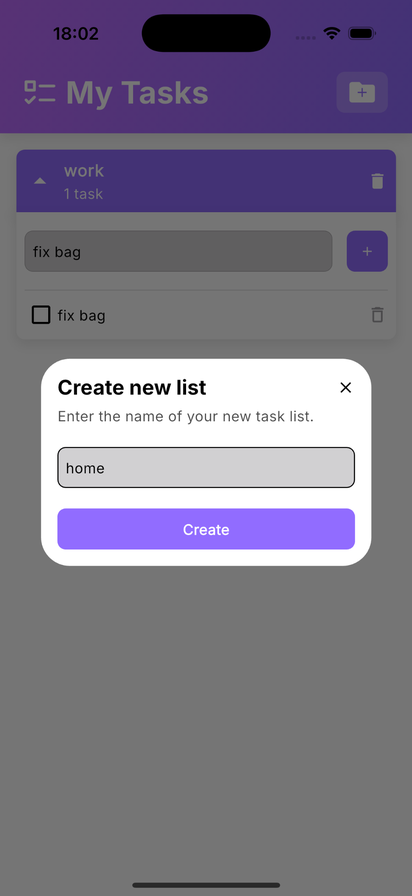
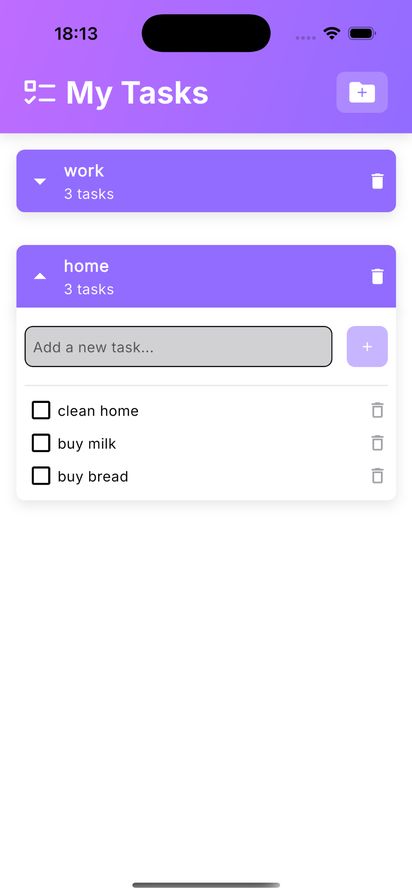

# 📝 Todo App

A simple and clean Todo application built with **Flutter**.  
The app allows users to organize tasks into separate lists, add new tasks, mark tasks as completed, and delete tasks and lists.

## ✨ Features

- Create multiple task lists
- Add tasks to a selected list
- Mark tasks as completed
- Delete individual tasks
- Delete entire task lists
- Expand and collapse task lists
- Empty-list state
- Local data persistence with SQLite
- Clean and structured UI

## 🛠 Tech Stack

- **Flutter / Dart**
- **flutter_bloc** — state management
- **SQLite / sqflite** — local data persistence
- **GetIt** — dependency injection
- **GoRouter** — navigation
- **Google Fonts** — typography
- **flutter_svg** — SVG assets

## 🏗 Architecture

The project follows a **feature-based Clean Architecture** approach.

```text
lib/
├── core/
│   ├── bloc/
│   ├── database/
│   ├── di/
│   ├── resources/
│   ├── route/
│   └── theme/
│
├── features/
│   ├── home/
│   │   ├── data/
│   │   │   ├── datasource/
│   │   │   ├── model/
│   │   │   └── repository/
│   │   │
│   │   ├── domain/
│   │   │   ├── entities/
│   │   │   ├── repository/
│   │   │   └── use_case/
│   │   │
│   │   └── presentation/
│   │       ├── bloc/
│   │       └── page/
│   │
│   └── widgets/
│
├── main.dart
└── my_app.dart
```

### Layers

- **Data** — SQLite datasource, models and repository implementations.
- **Domain** — business entities, repository contracts and use cases.
- **Presentation** — pages and BLoC-based state management.
- **Core** — shared database, dependency injection, routing, theme and resources.

## 📱 Screenshots

### Task management

| Tasks | Empty list |
|:---:|:---:|
|  |  |

### Creating and organizing lists

| Create a new list | Multiple task lists |
|:---:|:---:|
|  |  |

## 🚀 Getting Started

### Prerequisites

Make sure you have Flutter installed and configured.

### Installation

```bash
git clone https://github.com/SofiyaAndreyeva/todo_app.git
cd todo_app
flutter pub get
```

### Run

```bash
flutter run
```

## 💾 Local Storage

The application uses **SQLite** to persist task data locally, so tasks can be stored on the device without requiring a backend service.

## 🎯 Project Goal

This project was created to practice building a Flutter application using:

- Clean Architecture
- BLoC state management
- Dependency Injection
- Repository and Use Case patterns
- Local SQLite persistence
- Feature-based project structure

## 📄 License

This project is for educational and portfolio purposes.
